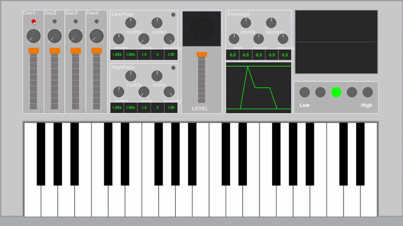
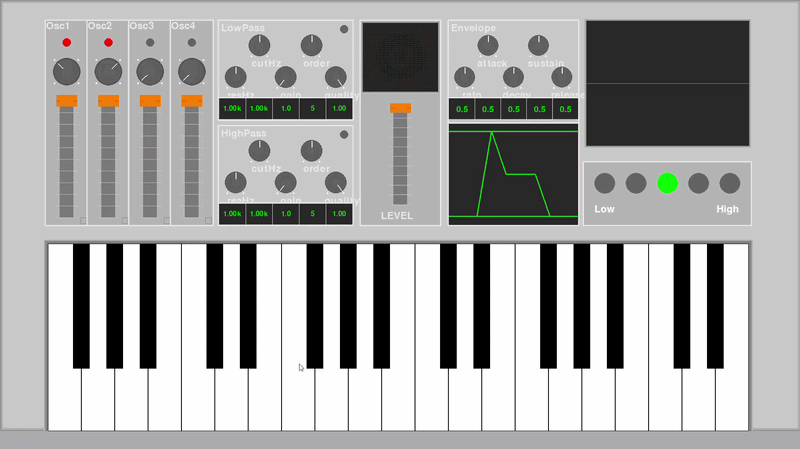
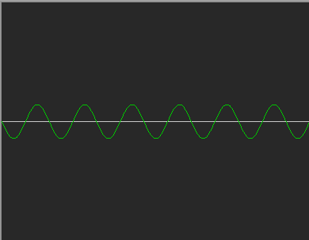
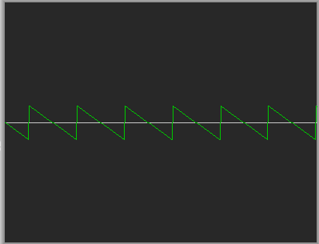
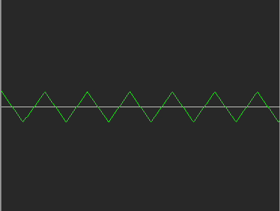
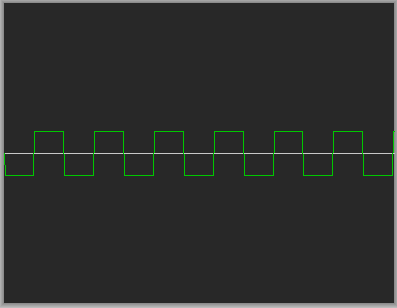
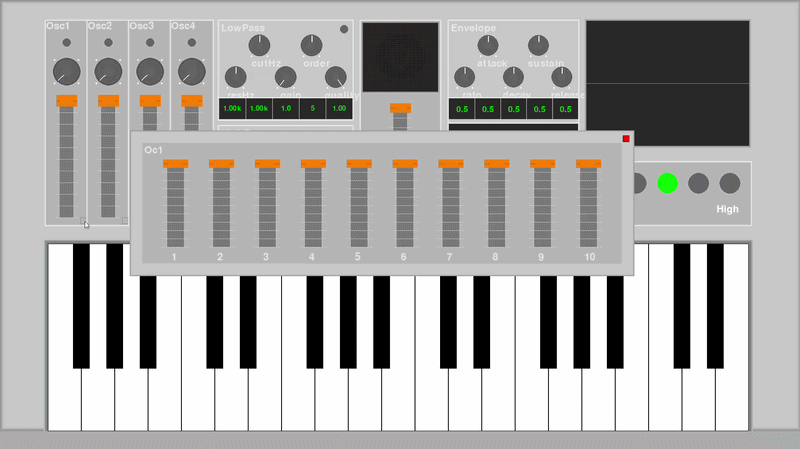

# Python Synthesizer

PythonとPygameを用いて開発したソフトウェアシンセサイザーです。

学部時代に加算合成シンセサイザーについて学習したときに制作しました。

シンセサイザーの基本構造であるオシレーター、加算合成、ADSRエンベロープ、フィルタ、オシロスコープを実装しました。

GUI上で音色を調整しながらリアルタイム演奏を行うことができます。

---

## デモ

<p align="center">
  
</p>
<p align="center">
  
</p>

## 主な機能

### 4オシレーター構成

4基の独立したオシレーターを搭載しています。

対応波形

- Sine Wave
- Sawtooth Wave
- Triangle Wave
- Square Wave

<p align="center">
  
  
  
  
</p>


各オシレーターは独立して設定でき、複数波形を組み合わせた音作りが可能です。

---

### 加算合成

各オシレーターには倍音スライダーを搭載しています。

```
基本周波数
+ 第2倍音
+ 第3倍音
...
+ 第10倍音
```

倍音ごとの振幅を調整することで、多彩な音色を生成できます。

---

### ADSRエンベロープ

以下のパラメータを調整できます。

- Attack
- Decay
- Sustain
- Release

音の立ち上がりや余韻を自由にコントロールできます。

---

### フィルタ

以下のフィルタを実装しています。

- Low-pass Filter
- High-pass Filter

調整可能パラメータ

- Cutoff Frequency
- Resonance Frequency
- Resonance Gain
- Filter Order
- Quality Factor (Q)

---

### オシロスコープ

生成した波形をリアルタイム表示します。

音色変化と波形変化の関係を視覚的に確認できます。

---

### 仮想鍵盤

PCキーボードおよびGUI鍵盤による演奏に対応しています。

オクターブ変更機能も搭載しています。

---

### ポリフォニック演奏

複数音の同時発音に対応しています。

コード演奏や和音確認が可能です。

---

## システム構成

```text
Keyboard Input
        │
        ▼
+----------------+
| Oscillator × 4 |
+----------------+
        │
        ▼
+----------------+
| Additive Synth |
+----------------+
        │
        ▼
+----------------+
| ADSR Envelope  |
+----------------+
        │
        ▼
+----------------+
| LPF / HPF      |
+----------------+
        │
        ▼
+----------------+
| Audio Output   |
+----------------+

        │
        ▼
+----------------+
| Oscilloscope   |
+----------------+
```

---

## 工夫した点

### 1. 加算合成による音色設計

単純な波形再生ではなく、倍音ごとの振幅を調整できる加算合成方式を採用しました。

これにより様々な音色を生成できます。

---

### 2. 4オシレーターによる柔軟な音作り

各オシレーターは

- 波形選択
- 音量調整
- 倍音設定
- ON/OFF

を独立して設定できます。

実際のシンセサイザーに近い構成を意識して設計しました。

---

### 3. リアルタイム波形可視化

生成した波形をオシロスコープに表示することで、

「音色変更 → 波形変化」

を直感的に理解できるようにしました。

---

### 4. フィルタによる音色加工

Butterworthフィルタを利用して

- LPF
- HPF

を実装しました。

さらに

- カットオフ周波数
- レゾナンス周波数
- Q値
- フィルタ次数

を調整可能にしています。

---

### 5. GUIコンポーネントの自作

以下のGUI部品を実装しました。

- Slider
- Knob
- LED Switch
- Draggable Window
- Keyboard
- Octave Display

Pygame標準機能のみを用いて構築しています。

---

### 6. オクターブ表示システム

LEDインジケータによって現在のオクターブ位置を視覚的に確認できるようにしました。

---

### 7. ポリフォニック演奏への対応

複数の鍵盤を同時に押した際、それぞれ独立したチャンネルで発音できるよう実装しました。

単音だけでなくコード演奏も可能です。

---

### 8. ドラッグ可能なウィンドウ設計

倍音調整画面は独立したウィンドウとして実装し、自由に移動できるようにしました。

画面サイズが大きくなっても操作しやすい構成を目指しました。

<p align="center">
  
</p>

---

### 9. モジュール化された設計

機能ごとにクラスを分割しています。

- Oscillator
- Filter
- ADSREnvelope
- Speaker
- Oscilloscope
- Keyboard
- WindowManager

機能追加や保守を行いやすい構成を意識しました。

---

## 技術的な学び

本プロジェクトを通して以下について学習しました。

### 音響処理

- 波形生成
- 周波数と音高の関係
- 加算合成
- ADSRエンベロープ
- デジタルフィルタ
- ポリフォニック発音

### ソフトウェア開発

- オブジェクト指向設計
- GUI設計
- リアルタイム処理
- イベント駆動プログラミング
- モジュール分割による保守性向上

---

## 使用技術

- Python 3.10
- Pygame
- NumPy
- SciPy

---

## インストール

```bash
pip install -r requirements.txt
```

---

## 実行方法

```bash
python main.py
```

---

## ディレクトリ構成

```text
.
├── main.py
├── synthesizer_app/
│   ├── audio.py
│   ├── components.py
│   ├── constants.py
│   ├── keyboard.py
│   ├── state.py
│   └── ui.py
│
├── examples/
│   ├── demo1.gif
│   ├── demo2.gif
│   ├── demo3.gif
│   ├── saw_wave.gif
│   ├── sin_wav.gif
│   ├── sq_wave.gif
│   └── tri_wave.gif
│
├── requirements.txt
├── README.md
└── .gitignore
```

---
